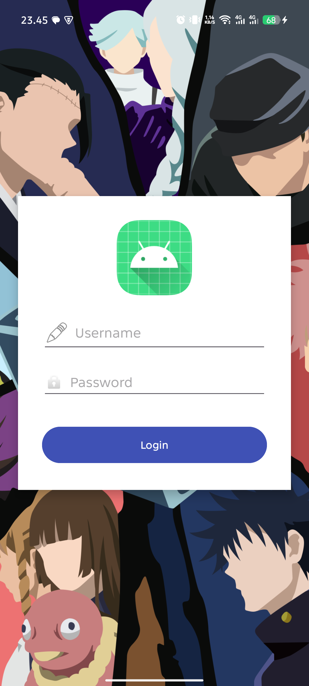
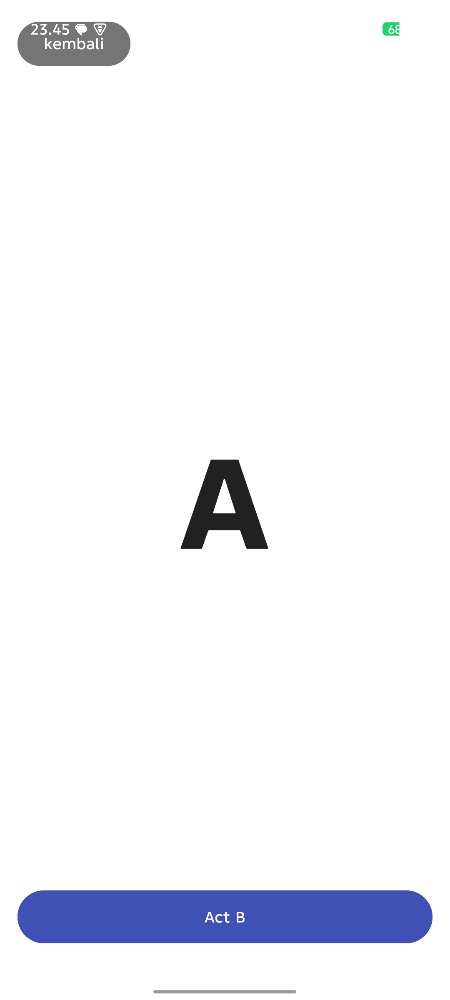
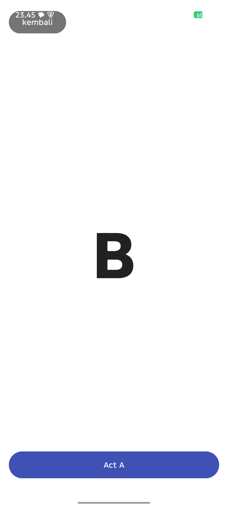

# Tugas Pra UTS - Aplikasi Android

Projek ini merupakan aplikasi Android sederhana yang dibangun menggunakan Java untuk memenuhi persyaratan tugas pra UTS.

## Fitur Utama
- **Halaman Login**: Simulasi login dengan background gambar `backgroundandroid.png`, logo, dan input field.
- **Navigasi Intent**: Perpindahan antar 3 Activity (Login -> A -> B) menggunakan Intent Explicit.
- **Mekanisme Kembali**: Navigasi kembali menggunakan tombol 'kembali' yang menerapkan fungsi `finish()`.
- **UI/UX Proper**: Layout yang rapi menggunakan `RelativeLayout` dan `LinearLayout` dengan elemen Material Design.

## Struktur Projek
1. `MainActivity`: Halaman Login.
2. `SecondActivity`: Halaman Activity A (Huruf A Besar).
3. `ThirdActivity`: Halaman Activity B (Huruf B Besar).

## Cara Preview dan Testing
1. Buka projek ini menggunakan **Android Studio**.
2. Pastikan HP Android sudah terhubung atau gunakan Emulator.
3. Klik tombol **Run** (Ikon Play Hijau).
4. Aplikasi akan terinstal dan siap diuji sesuai diagram alur.

## Preview Tampilan
Berikut adalah tampilan aplikasi pada perangkat Android:

### 1. Halaman Login

### 2. Activity A

### 3. Activity B

