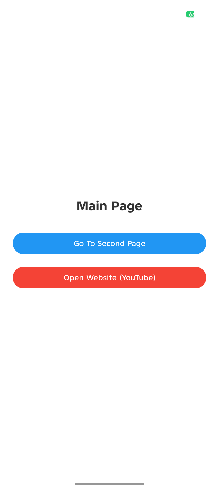
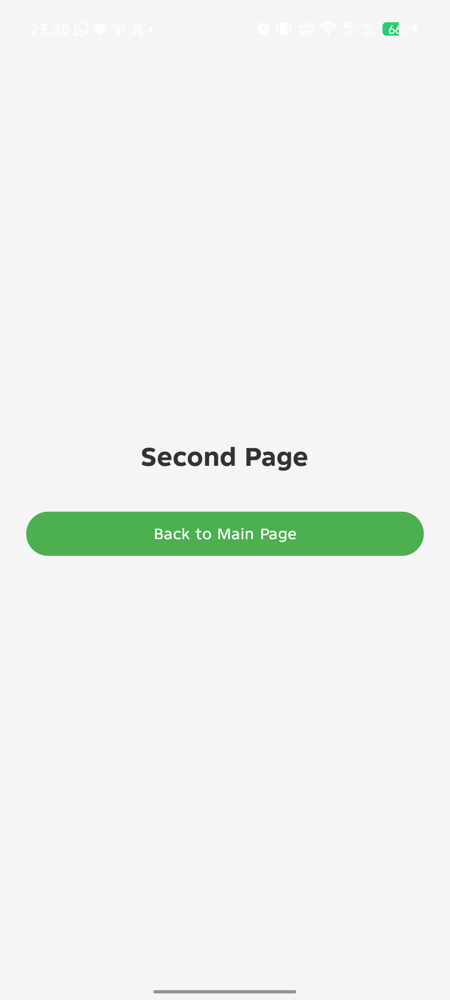

# Tugas Pra UTS - Aplikasi Android

Projek ini merupakan aplikasi Android sederhana yang dibangun menggunakan Java untuk memenuhi persyaratan tugas pra UTS.

## Fitur dan Requirement
- 2 Halaman (Activity): MainActivity dan SecondActivity.
- Intent Navigasi: 1 intent untuk berpindah ke halaman kedua.
- Intent Kembali: 2 intent untuk kembali ke halaman utama (melalui tombol navigasi dan sistem).
- Link Website: 1 button link ke website menggunakan implicit intent.

## Persiapan dan Setup
1. Pastikan Android Studio sudah terinstal di perangkat.
2. Buka Android Studio dan pilih menu Open.
3. Arahkan ke direktori projek ini dan tunggu hingga proses sinkronisasi Gradle selesai.
4. Pastikan SDK Android yang diperlukan sudah terunduh melalui SDK Manager.

## Cara Preview dan Testing
1. Hubungkan perangkat Android fisik melalui kabel data atau jalankan Emulator Android.
2. Klik tombol Run (ikon segitiga hijau) pada toolbar bagian atas Android Studio.
3. Pilih perangkat tujuan dan tunggu hingga proses instalasi aplikasi selesai.
4. Setelah aplikasi terbuka, lakukan pengetesan pada tombol navigasi untuk berpindah halaman.
5. Tekan tombol kembali untuk memastikan navigasi ke halaman utama berfungsi.
6. Tekan tombol link website untuk menguji pembukaan browser eksternal.

## Preview Aplikasi
Berikut adalah tampilan aplikasi pada perangkat Android:

### Halaman Utama

### Halaman Kedua

